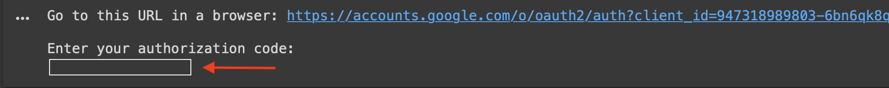

<!-- TABLE OF CONTENTS -->
<details open="open">
  <summary><h2 style="display: inline-block">Table of Contents</h2></summary>
  <ol>
    <li>
      <a href="#About-The-Project">About The Project</a>
      <ul>
        <li><a href="#built-with">Built With</a></li>
      </ul>
    </li>
    <li>
      <a href="#Getting-Started">Getting Started</a>
      <ul>
        <li><a href="#Pre-requisites">Pre-requisites</a></li>
          <ul>
            <li><a href="#Installation-on-local-machine-(Optional)">Installation on local machine (Optional)</a></li>
             <ul>
               <li><a href="#Pip-Version">Pip version</a></li>
               <ul>
                 <li><a href="#Install-packages-on-Mac">Install packages on Mac</a></li>
                 <li><a href="#Install-packages-on-Windows">Install packages on Windows</a></li>
               </ul>
             </ul>
             <ul>
                 <li><a href="#Conda-Version">Conda version</a></li>
                 <ul>
                   <li><a href="#Install-Conda-(Mac/Windows)">Install Conda (Mac/Windows)</a></li>
                   <li><a href="#Install-environment-for-Mac">Install environment for Mac</a></li>
                   <li><a href="#Install-environment-for-Windows">Install environment for Windows</a></li>
                   <li><a href="#Activating-the-environment">Activating the environment</a></li>
                 </ul>
             </ul>
          </ul>
      </ul>
    <li><a href="#The-Workflow">The Workflow</a></li>
    <ul>
      <li><a href="#Cloning-the-Github-repository">Cloning the Github repository</a></li>
      <li><a href="#Mounting-Google-Drive">Mounting Google Drive</a></li>
      <li><a href="#Authenticating-Google-Earth-Engine">Authenticating Google Earth Engine</a></li>
      <li><a href="#Authenticating-Google-Cloud-Storage-(Optional)">Authenticating Google Cloud Storage (Optional)</a>
    </ul>
    <li><a href="#Custom-Packages">Custom Packages</a></li>
      <ul>
          <li><a href="#Testing-Suite">Testing Suite</a></li>
      </ul>
    <li><a href="#License">License</a></li>
    <li><a href="#Contact">Contact</a></li>
    </li>
</details>

<!-- ABOUT THE PROJECT -->
# About The Project
The aim of the project is to build a cloud-based mangroves monitoring framework using Google Collaboratory, Google Earth Engine and Google Storage and using Convolutional Neural Networks for the classification of landcover types.

## Built With

* [Google Colab](https://colab.research.google.com)
* [Google Earth Engine Python API](https://developers.google.com/earth-engine/guides/python_install)
* [Python3](https://www.python.org/)

<!-- GETTING STARTED -->
# Getting Started
Follow the instructions below to correctly run the monitoring framework.

## Pre-requisites
The project is completely cloud-based and it uses `Google Collaboratory`as the core platform.

The pre-requisites are:
- Stable internet connection.
- Have a **Gmail account ->** please see instructions to create one here: https://support.google.com/accounts/answer/27441?hl=en
- Have a **Google Earth Engine account ->** please see instructions how to get one here: https://signup.earthengine.google.com/

The frameowrk is setup to rely on **Google Drive** as the main Cloud Storage. Nonetheless, the user may wish to use **Google Cloud Storage** instead by setting up a google storage bucket using the following link: https://cloud.google.com/storage

***Please Note: Google Collaboratory is built on Jupyter Notebooks and as such, the notebooks that it generates and that are saved on Google Drive may be downloaded and used on a local machine. If the user wishes to do so, however, will need to enable Google Drive API access. Please see this guide for further details: https://medium.com/@umdfirecoml/a-step-by-step-guide-on-how-to-download-your-google-drive-data-to-your-jupyter-notebook-using-the-52f4ce63c66c. Nevertheless, given that the aim of the project is to provide a fully-functional online platform, this was mainly developed for internet browser use only and the use on local machines is not adviced unless possessing a powerful computer with large memory GPU/ TPU***


### Installation on local machine (Optional)
**USE THIS SECTION ONLY IF WANTING TO EXECUTE THE PROJECT ON A LOCAL MACHINE - NOTE THIS IS NOT ADVISED UNLESS POSSESSING A POWERFUL COMPUTER WITH LARGE GPU/ TPU MEMORY.**

#### Pip Version
The first step is to upgrade the current version of pip by typing:
```
pip install --upgrade pip
```

Then, the user needs to make sure to have the python version 3.8.5 installed. If it is not, please follow this link to install it: https://www.python.org/downloads/

##### Install packages on Mac
In the command line, type in:
```
python -m pip install -r requirements.txt
```

##### Install packages on Windows
In the command line, type in:
```
py -m pip install -r requirements.txt
```

---

#### Conda Version
##### Install Conda (Mac/Windows)
It is possible that Conda is already installed on your computer. To check if it is installed it will be enough to type in the terminal:
```
conda --help
```
which will return the Conda version if installed or it will read *'conda not found or not recognized as a command'*.

For the purpose of this project it will be enough to install the Miniconda, that is a lighter version of Conda.

##### Install environment for Mac
- To download Miniconda to your Home directory type in the following in the terminal:
```
curl https://repo.anaconda.com/miniconda/Miniconda3-latest-MacOSX-x86_64.sh -o ~/miniconda.sh
```
- Installing Miniconda quietly accepting defaults settings
```
bash ~/miniconda.sh -b -p
```
- Removing Miniconda from your Home directory
```
rm ~/miniconda.sh
```

#####  Install environment for Windows
- To download Miniconda to your Home directory type in the following in the terminal:
```
powershell -command "Invoke-WebRequest -Uri https://repo.anaconda.com/miniconda/Miniconda3-latest-Windows-x86_64.exe -OutFile ~\miniconda.exe"
```
- Installing Miniconda quietly accepting defaults settings
```
start /B /WAIT %UserProfile%\miniconda.exe /InstallationType=JustMe /AddToPath=0 /RegisterPython=0 /S /D=%UserProfile%\miniconda3
```
- Removing Miniconda from your Home directory
```
del %UserProfile%\miniconda.exe
```

Conda needs to be initialised for shell interaction by typing:
```
conda init --help
```

The next step is to restart the command line interface and type:
```
conda activate
```
which will activate the base conda environment.

##### Activating the environment
To succesfully run the workflow, it is necessary to install the basic needed packages. If deciding to use Conda, then the next step is to activate the `mangroves` environment by typing:
```
conda env create -f environment.yml
```

This will install all the needed packages to smoothly run this project. 
In order to get access the environment and all its installed packages, please type:
```
conda activate mangroves
```

/
<!-- THE WORKFLOW -->
## The Workflow
The monitoring framework has been split into three Google Colab notebooks a follow:

| Notebook | Description |
| :--- | :--- |
| **[Notebook_1-Generate_Patches](https://github.com/davidelomeo/mangroves_deep_learning/blob/main/Notebook_1-Generate_Patches.ipynb)** | Acquisition of satellite imagery from the Google Servers using GEE; classification of a target geographical area; export of the classified image as TensorFlow (TF) records (TFRecords) patches of user-defined size (pixels) |
| **[Notebook_2-Generate_model](https://github.com/davidelomeo/mangroves_deep_learning/blob/main/Notebook_2-Generate_Model.ipynb)** | Import TFRecords and convert them into datasets ready to be fed into Neural Networks (NNs); use Keras API to train newly generated or pre-trained NNs |
| **[Notebook_3-Make_Predictions](https://github.com/davidelomeo/mangroves_deep_learning/blob/main/Notebook_3-Make_Predictions.ipynb)** | Acquisition of satellite imagery of a small target area using GEE; export the image as TFRecord patches; load NNs models to make predictions of the target image |

The notebooks have been designed to work as standalones and each has a speficic task as described above. The user may decide which notebook to use according to needs. Nonethelss, if the aim of the user is to take advantage of the full monitoring framework, then it is necessary to follow the numbering of the notebooks (1 to 3) as showed in the table above.

### Cloning the Github repository
Right at the start of each notebook, the user is prompted to clone the current github repository. This is necessary to access the `requirements.txt` file, that will be used to install all the necessary pakcages, inlcluding three custom packages (please see section `Custom Packages` below for details).

The repository is cloned using a Token. This action is not generally advisable because it provides full access and to the repo and full ability to push changes to it to whomever possesses it. The reason for providing one is because the current repo is private, and as such providing the Token to others (in this case the markers of the project) is the only way to get full access to the repo. If the project ever becomes public, the token will be removed.

### Mounting Google Drive
The notebooks require the user to mount a target google drive for the workflow to function properly. When running the cells to import the required packages, the notebook will show a link and prompt the user to click on it (the link will be opened on a new page), login to the Gmail account (please look at the pre-requisites above if you don't have an account yet) and copy the one-time key that appears on the page into the empty box that appears within the Google Colab notebook as shown in the picture below.
<p align="center">
  
</p>

### Authenticating Google Earth Engine
Every notebook requires that the user authenticates Google Earth Engine. The process is identical to mounting a Google Drive above. Please look at the pre-requisites above if you don't have a Google Earth Engine account yet.

### Authenticating Google Cloud Storage (Optional)
The user may prefer to use Google Cloud Storage over Google Drive in some paet of the workflow (keep in mind tha the use of Google Drive is mandatory). The notebooks, therefore, have been setup to accomodate either. If the user wants to use Google Cloud Storage, will need to authenticate it like Google Earth Engine above. Please look at the pre-requisites for more information about having a Google Cloud Storage Account.

<!-- CUSTOM PACKAGES -->
## Custom Packages
The project implements three custom packages. More info are available [here](https://github.com/davidelomeo/mangroves_deep_learning/tree/main/custom_packages)

### Testing Suite
The custom packages have a built-in test suite that can easily be run using `pytest`.
Pytest can be installed by typing in the terminal:
```
pip install pytest
```
and the testing suite can be run from the main folder of this project, from the custom_packages folder and from within each of the packages' foilder by typing in the terminal:
```
pytest
```

<!-- LICENSE -->
## License
Distributed under the MIT License. See `LICENSE` for more information.

<!-- CONTACT -->
## Contact
Davide Lomeo - davide.lomeo.21@ucl.ac.uk
